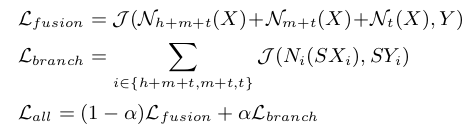
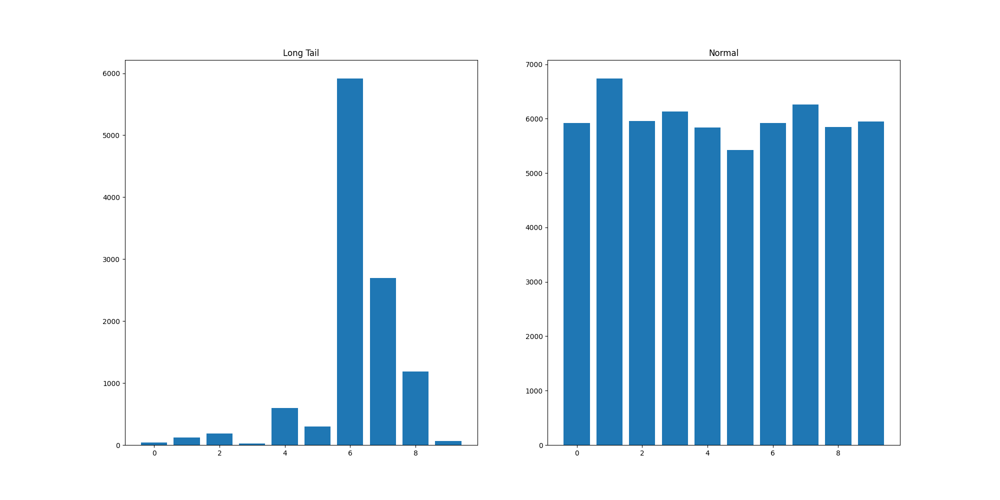
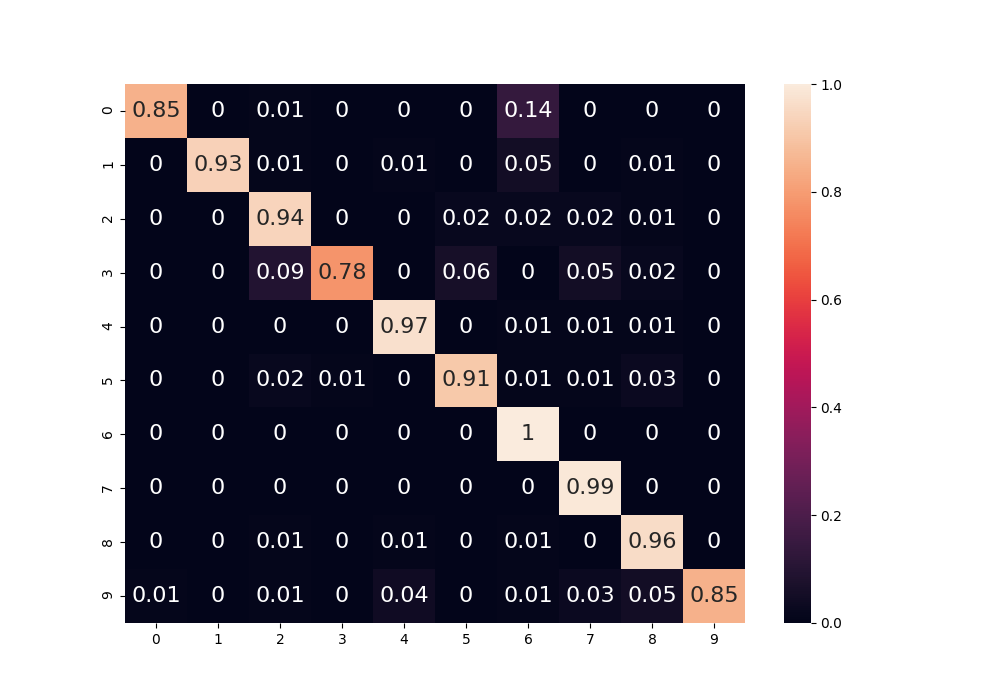

### Introduction
<br>
<br>
This repository contains an independent implementation of the method presented by the authors of the paper [ResLT](https://arxiv.org/abs/2101.10633): Residual Learning for Long-tailed Recognition. As we focused only on understanding and implementing the idea, we used the MNIST dataset to speed-up the process. We encourage others to try in other databases (i.e. ImageNet-LT, Places-LT and iNaturalist 2018) to compare with the results presented by the authors.
<br>
<br>

### Residual Learning for Long-Tail Recognition

<br>
<br>
The idea of the authors was to use a combination of shared feature representation and specialized classifiers, where we use a classifier for each one of three groups of samples: head + medium + tail, medium + tail and tail. Here, we coined a classifier as the combination of a convolutional and dense layer. 
<br>
<br>
The combination of a shared feature representation and specialized classifier composes a branch. Thus, we have **h+m+t**, **m+t** and **t** branches. Each one of these branches has a different loss function (i.e. categorical cross-entropy loss). In addition, we combine the output of each branch in a fusion that is trained jointly with the branches (residual fusion module). Figure 1 shows these loss functions.  
<br>
<br>


<center>Figure 1. Loss functions used in the ResLT. Extracted from the original paper.</center>
<br>

As mentioned by the authors, the reason behind the formulation is to _gradually enhance classification results on tail classes with other learned residual branches_.

<br>

### MNIST-LT

<br>
<br>

The MNIST-LT is a long-tail version of the MNIST dataset that I used in these experiments. It is not the ideal scenario to evaluate long-tail classification as the MNIST does not have a large intraclass variance and small interclass similarity. The distribution of samples per label in the MNIST-LT obtained using the pareto distribution is presented in the Figure 2. To obtain the head, medium and tail groups, we used the threshold of 100 and 1000. It means that classes with fewer samples than 100 are clustered in the tail group, between 100 and 1000 are clustered in the medium and above 1000 are in the head cluster.

<br>


<center> Figure 2. Distribution of the number of samples per class in the MNIST-LT.</center>

<br>
<br>

### How to run?

<br>
<br>
To run the code, you should create an environment (not mandatory) and run:

```
pip install -r requirements.txt
```

Then, to run the code, just use:

```
python main.py
```

One can  play with the $\alpha$ parameter, which controls the influence of the fusion and the branches in the final loss. 

<br>
<br>

### Experimental Results

<br>
<br>

Running the proposed model with an $\alpha$ equal 0.5 we reached a normalized accuracy of **91.67%**. It is possible to notice that there is a correlation between the cardinality of the class and the obtained accuracy. 

The ResLT performs better than a baseline model that only trains the model without the ResLT and using the instance sampling (uniform sampling), which obtained **84.28%**.

<br>
<br>


<center> Figure 3. Confusion matrix obtained using the ResLT model.</center>


